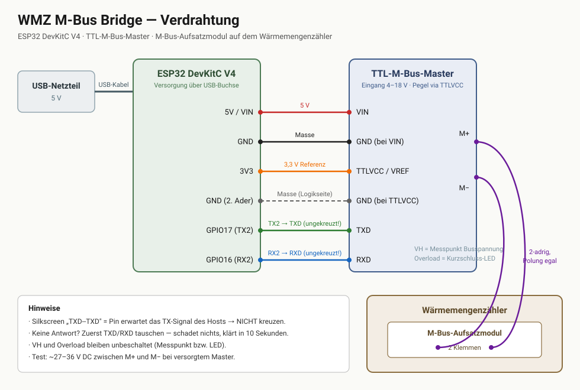

# esphome-mbus-heatmeter

**Read heat meters (M-Bus, EN 13757-3) with an ESP32 and expose them to Home Assistant via ESPHome — no cloud, no gateway.** Documentation below is in German.

---

Wärmemengenzähler per **drahtgebundenem M-Bus** über einen ESP32 in Home Assistant einbinden. Der ESP32 mit M-Bus-Master liefert die Zählerwerte als native ESPHome-Sensoren.

Ausgelesen werden je nach Zähler:

| Wert | Einheit | Nutzen |
|---|---|---|
| Wärmemenge (Zählerstand) | kWh | eichgeprüft, direkt Energy-Dashboard-tauglich |
| Volumen | m³ | kumuliert |
| Durchfluss | l/h | Momentanwert |
| Vorlauf-/Rücklauftemperatur | °C | Momentanwerte |
| Spreizung | K | Momentanwert |
| Leistung | W | Momentanwert — die eigentlich interessante Größe |


Gesamtkosten: **rund 55–70 €.** Stromverbrauch: **~1 W** (≈ 9 kWh/Jahr).

---

## Funktionsprinzip

```
Wärmemengenzähler ──(optisch, intern)── M-Bus-Aufsatzmodul
                                              │  2-adrig, polungsfrei
                                       TTL-M-Bus-Master
                                              │  UART 2400 8E1
                                            ESP32
                                              │  WLAN
                                        Home Assistant
```

Der Zähler selbst hat meist nur eine optische Schnittstelle. Das **M-Bus-Aufsatzmodul** wird auf den Zähler gesteckt, liest ihn intern aus und stellt die Werte auf dem M-Bus bereit. Der **TTL-M-Bus-Master** erzeugt die Busspannung (~27–36 V) und übersetzt zwischen M-Bus-Pegel und UART. Der **ESP32** spricht das M-Bus-Protokoll (EN 13757-3) und veröffentlicht die dekodierten Werte über die ESPHome-API.

---

## Kompatible Wärmemengenzähler

**Grundsätzlich funktioniert jeder Zähler mit drahtgebundener M-Bus-Schnittstelle** (EN 13757-3, 2400 Baud). Die Sensordefinition erfolgt über VIF-Codes, die im Standard weitgehend einheitlich sind — bei abweichenden Zählern müssen ggf. die VIFs angepasst werden (siehe [docs/telegramm-analyse.md](docs/telegramm-analyse.md)).

### Verifiziert

| Zähler | Modul | Status |
|---|---|---|
| **Rossweiner heatplus OPTO** (Meibes) | Qundis Q module 5.5 M-Bus (MHM500A20000) | ✅ vollständig getestet, alle 7 Werte |

### Baugleich / sehr wahrscheinlich kompatibel

Der Rossweiner heatplus ist ein OEM-Rebrand des **Qundis Q heat 5.5**. Dieselbe Hardware wird unter mehreren Namen verkauft:

- **Qundis Q heat 5 / 5.5** — das Original
- **Rossweiner heatplus / heatplus extra** (Meibes System-Technik)
- **Techem compact V** (verwandte Qundis-Plattform)
- weitere OEM-Varianten regionaler Anbieter

Für alle gilt: Modul **Q module 5.5 M-Bus** aufsteckbar, identische Telegrammstruktur zu erwarten.

Der **Qundis Q heat 5.5 US** (Ultraschall) nutzt ein anderes Aufsatzmodul — die Kommunikation ist gleich, das Modul ist es nicht. Vor dem Kauf prüfen.

### Andere Hersteller (M-Bus-Standard, VIFs ggf. anzupassen)

Diese Zähler sprechen ebenfalls drahtgebundenen M-Bus und sollten mit angepassten VIF-Codes funktionieren — **nicht getestet**, Rückmeldungen willkommen:

- **Engelmann SensoStar** (U/C/2+) — M-Bus-Modul nachrüstbar
- **Zenner Multidata / zelsius** — M-Bus-Modul nachrüstbar
- **Diehl Metering / Hydrometer Sharky 775 / 773**
- **Sontex Supercal 5 / 739**
- **Kamstrup Multical 302 / 403 / 603** — M-Bus-Modul, Werte teils in anderen Einheiten
- **Itron / Allmess CF Echo II, Integral-MK**
- **Landis+Gyr T230 / T450**
- **Techem, ista, Minol** — Mietgeräte, siehe Warnhinweis unten

> **Mietgeräte:** Zähler von Messdienstleistern (Techem, ista, Minol, Brunata …) gehören meist nicht dem Nutzer. Das Aufstecken eines eigenen Kommunikationsmoduls kann Vertrags- oder Plombenfragen berühren. Vorher klären.

Auch **Kältezähler, Wasserzähler und Gaszähler** mit M-Bus lassen sich mit derselben Hardware auslesen — nur die Sensordefinitionen unterscheiden sich.

---

## Bill of Materials

| # | Komponente | ca. Preis | Bezugsquelle (Beispiel) |
|---|---|---|---|
| 1 | **ESP32 DevKitC V4** (ESP32-WROOM-32D/32U) | ~6 € | [AliExpress](https://de.aliexpress.com/item/1005007820190456.html) |
| 2 | **TTL-zu-M-Bus-Master-Modul** (1–10 Slaves, Eingang 4–18 V) | ~12 € | [AliExpress](https://de.aliexpress.com/item/1005006293773527.html) |
| 3 | **Qundis Q module 5.5 M-Bus** (MHM500A20000) | ~40 € | [eBay](https://www.ebay.de/itm/286814945093), Zählershops |
| 4 | USB-Netzteil 5 V + Kabel | ~5 € | Restekiste |
| 5 | 4–6 Dupont-Kabel (female-female) | ~2 € | Restekiste |
| 6 | 2-adrige Leitung für den Bus (z. B. Klingeldraht, J-Y(St)Y) | ~2 € | Restekiste |

**Wichtig bei Position 2:** Diese Module werden als **Master-** *und* **Slave-Variante** unter derselben Artikelnummer verkauft. Zum Auslesen eines Zählers wird zwingend die **Master**-Variante benötigt. Achte außerdem auf einen `TTLVCC`- bzw. `VREF`-Pin — darüber wird der Logikpegel auf 3,3 V gesetzt, sodass kein Pegelwandler nötig ist.

**Wichtig bei Position 3:** Das Modul muss zum Zähler passen. Für Q heat 5 / 5.5 und die OEM-Rebrands ist es das Q module 5.5 M-Bus. Die Meibes-Bestellnummer (127 504 0) ist im Handel praktisch nicht auffindbar — unter dem Qundis-Namen bzw. `MHM500A20000` schon.

Ein **Multimeter** ist zur Inbetriebnahme sehr hilfreich (Busspannung prüfen).

---

## Verdrahtung



| ESP32 | M-Bus-Master |
|---|---|
| 5V / VIN | VIN |
| GND | GND (bei VIN) |
| 3V3 | TTLVCC / VREF |
| GND | GND (bei TTLVCC) |
| GPIO17 (TX2) | TXD |
| GPIO16 (RX2) | RXD |

Vom Master gehen **M+ / M−** zweiadrig zu den beiden Klemmen des Aufsatzmoduls am Zähler. **Die Polung ist egal** — M-Bus ist verpolungssicher.

### Hinweise

- **TX/RX nicht kreuzen.** Die Beschriftung `TXD--TXD` / `RXD--RXD` auf diesen Platinen bedeutet: „hier das gleichnamige Signal des Hosts anschließen". Kommt keine Antwort, ist Tauschen der beiden Adern der erste Test — es kann nichts beschädigen.
- **`VH` und `Overload` bleiben unbeschaltet.** `VH` ist ein Messpunkt für die Busspannung, `Overload` eine Kurzschluss-LED.
- **Pinbeschriftungen variieren** je nach Charge. Nach Funktion zuordnen, nicht nach Position.
- **Aufstellort:** ESP + Master direkt beim Zähler platzieren, kurzes Buskabel, WLAN übernimmt die Strecke. Eine Steckdose in Reichweite genügt.

---

## Inbetriebnahme

### 1. M-Bus-Komponente installieren

Dieses Projekt nutzt die externe ESPHome-Komponente [`eegerferenc/esphome-mbus-component`](https://github.com/eegerferenc/esphome-mbus-component).

Da das Repository den Komponentenordner im Root führt (nicht unter `components/`), funktioniert die `github://`-Quelle nicht direkt. Die Komponente muss lokal neben die ESPHome-Konfiguration kopiert werden:

```bash
git clone --depth 1 https://github.com/eegerferenc/esphome-mbus-component.git /tmp/mbus-src
mkdir -p <esphome-config-dir>/components
cp -r /tmp/mbus-src/mbus <esphome-config-dir>/components/
```

`<esphome-config-dir>` ist je nach Add-on-Generation `/config/esphome` oder `/addon_configs/5c53de3b_esphome`. Danach muss `components/mbus/__init__.py` existieren.

### 2. Konfiguration anpassen

- [`esphome-mbus-heatmeter.yaml`](esphome-mbus-heatmeter.yaml) ins ESPHome-Verzeichnis kopieren
- [`secrets.yaml.example`](secrets.yaml.example) als Vorlage für die eigene `secrets.yaml` nutzen
- API-Key und OTA-Passwort erzeugt ESPHome beim ersten Anlegen selbst

### 3. Modul aufstecken

**Das Aufsatzmodul muss auf dem Zähler sitzen, bevor sinnvolle Daten kommen.** Ein lose an den Bus geklemmtes Modul antwortet zwar — aber nur mit seiner eigenen Selbstauskunft (Medium „unbekannt", eigene Seriennummer, keine Verbrauchswerte). Plan aufstecken bis zum spürbaren Einrasten.

Nach dem Aufstecken **10–15 Minuten warten**: Das Modul liest den Zähler intern nur alle 10 Minuten aus.

### 4. Flashen und prüfen

Erwartete Werte im ESPHome-Log:

```
[S][sensor]: 'Waermemenge' >> 47652.0 kWh
[S][sensor]: 'Volumen' >> 3984.376 m³
[S][sensor]: 'Durchfluss' >> 0 l/h
[S][sensor]: 'Vorlauftemperatur' >> 28.9 °C
```

### 5. Funktionstest der Hardware (falls nichts kommt)

Mit dem Multimeter zwischen **M+ und M−** messen: bei versorgtem Master müssen **~27–36 V DC** anliegen. Weniger als ~21 V ist zu wenig — dann ein 12-V-Netzteil an VIN des Masters hängen (der Eingang verträgt 4–18 V) statt der 5 V vom ESP.

---

## Troubleshooting

| Symptom | Ursache | Abhilfe |
|---|---|---|
| Keine Antwort, Timeouts | TX/RX vertauscht | Datenadern tauschen |
| Keine Antwort | Busspannung zu niedrig | 12 V an VIN des Masters |
| Antwort, aber nur Identifikationsdaten (Medium `0x0F`, keine Verbrauchswerte) | **Modul sitzt nicht auf dem Zähler** | Modul aufstecken, 10–15 min warten |
| Telegramm kommt, aber Sensoren bleiben leer | `secondary_address` explizit gesetzt | Zeile auskommentieren (Wildcard nutzen), siehe unten |
| Werte ändern sich nie | Modul liest den Zähler nur alle 10 min | `update_interval: 600s`, normal |
| Datensalat / Prüfsummenfehler | UART-Parität | 2400 Baud, 8 **E**1 — Even-Parität ist Pflicht |

### Bekannte Einschränkung: `secondary_address`

Wird die Sekundäradresse in der `mbus:`-Sektion **explizit** gesetzt, kommt das Telegramm zwar an, die Sensoren finden ihre Records aber nicht (vermutlich ein Byte-Reihenfolge-Problem im Adressvergleich der Komponente). Mit der Default-Wildcard (`FFFFFFFFFFFFFFFF`) funktioniert alles.

Praktisch relevant ist das erst bei **mehreren Zählern am selben Bus** — dann werden Adressen zur Unterscheidung gebraucht. Bei einem einzelnen Zähler ist die Wildcard funktional gleichwertig.

### Multi-Telegramm-Zähler

Manche Zähler verteilen ihre Daten auf mehrere Telegramme, die per FCB-Toggle nacheinander abgerufen werden müssen. Die Upstream-Komponente fordert pro Zyklus nur ein Telegramm an und meldet in dem Fall `Multitelegram readout not supported`.

Der hier dokumentierte Rossweiner heatplus liefert **alle** Werte in einem einzigen Telegramm (232 Bytes) — für ihn ist das kein Thema. Bei anderen Zählern kann eine Erweiterung der Komponente nötig sein.

---

## Dateien

```
esphome-mbus-heatmeter.yaml   ESPHome-Konfiguration
secrets.yaml.example          Vorlage für WLAN-Zugangsdaten
docs/wiring.svg               Verdrahtungsdiagramm
docs/telegramm-analyse.md     VIF-Zuordnung, Telegrammaufbau, eigene Zähler anpassen
```

---

## Stromverbrauch

Rund **1 W** an der Steckdose (ESP32 ~0,4 W mit `power_save_mode: light` und 80 MHz CPU-Takt, M-Bus-Master ~0,15 W, Netzteilverluste ~0,2 W). Das Aufsatzmodul zieht seine ~1,5 mA aus dem Bus und rührt die 10-Jahres-Batterie des Zählers nicht an.

Der Bus sollte **nicht** zum Stromsparen abgeschaltet werden: Das Modul braucht Dauerversorgung für seinen internen 10-Minuten-Lesezyklus.

---

## Beiträge

Rückmeldungen zu weiteren Zählern sind ausdrücklich willkommen — insbesondere VIF-Zuordnungen anderer Hersteller. Ein Issue mit Zählermodell, Modul und einem Telegramm-Hexdump genügt; daraus lässt sich die Sensordefinition ableiten.

## Lizenz

MIT — siehe [LICENSE](LICENSE).

Kein Zusammenhang mit Qundis, Meibes/Rossweiner oder anderen genannten Herstellern. Markennamen dienen nur der Identifikation der Geräte.
